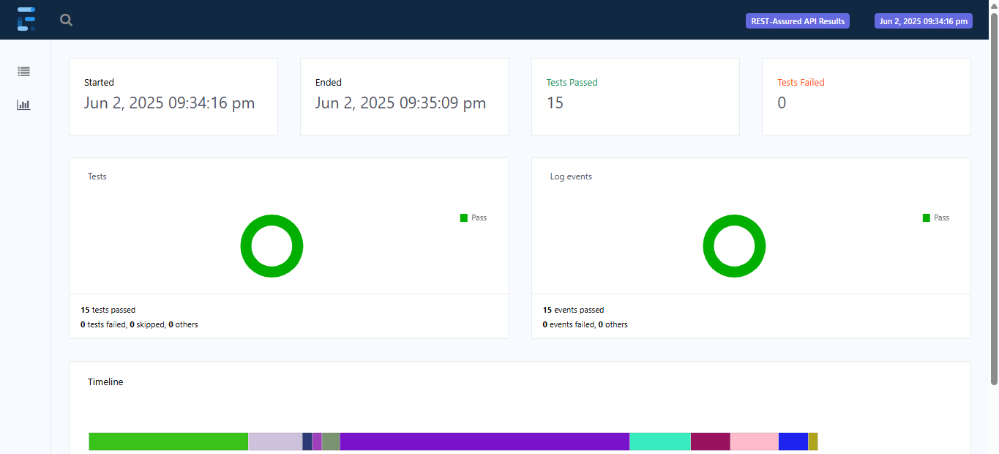

# Automated API & UI Test Framework

A **Java 17 / Maven / TestNG** framework that demonstrates both **UI automation** (Selenium WebDriver) and **API automation** (Rest-Assured) running in **GitHub Actions**. It generates a one-click **Extent Spark HTML** report on every push. Use it as a learning project or a bootstrap template for real-world regression suites.

---

## ✨ Key Features

| Layer | Highlights |
|-------|------------|
| **UI Automation** | • Page-Object Model (Wikipedia smoke test)<br>• WebDriverManager + headless Chrome (CI-friendly)<br>• Parallel execution via TestNG suite XML |
| **API Automation** | • CRUD tests against `jsonplaceholder.typicode.com`<br>• Auth & header checks against `httpbin.org`<br>• JSON-schema validation with `json-schema-validator` |
| **BDD (Cucumber)** | • Feature files in `src/test/resources/features`<br>• Steps and hooks in `com.example.bdd` |
| **Reporting** | • Extent Spark HTML report (`target/ExtentReport.html`)<br>• Cucumber HTML report (`target/cucumber-report.html`)<br>• Archived as a GitHub Actions artefact |
| **CI/CD** | • Ubuntu latest runner<br>• Dependency cache for faster builds<br>• JDK 17 via Temurin distribution |

---

## 🗂️ Project Structure

```
├── src
│   ├── main
│   │   └── java
│   │       └── com/example/apitests      (sample Main class)
│   └── test
│       ├── java
│       │   ├── com/example/apitests      (API tests)
│       │   ├── com/example/uitests       (UI tests)
│       │   ├── com/example/bdd           (Cucumber runner, steps, hooks)
│       │   ├── com/example/pages         (Page Objects)
│       │   └── com/example/tests         (BaseTest)
│       └── resources
│           ├── features                  (Cucumber feature files)
│           └── schemas                   (JSON schemas)
├── .github/workflows/ci.yml              (GitHub Actions pipeline)
├── images                                (report screenshots)
├── testng.xml                            (parallel suite)
└── pom.xml                               (dependencies & plugins)
```

---

## 🚀 Quick Start

### 1  Clone & prerequisites
```bash
# JDK 17 and Maven 3.9+ required
$ git clone https://github.com/your-handle/your-repo.git
$ cd your-repo
```

### 2  Run the full suite locally
```bash
$ mvn clean test -Dsurefire.suiteXmlFiles=testng.xml
```

### 3  View the report
```text
Open target/ExtentReport.html in your browser.
The Cucumber HTML report is at target/cucumber-report.html.
```

> **Tip :** Add `-Dskip.ui=true` or `-Dskip.api=true` flags if you split profiles later.

---

## 🏗️ Design Decisions

* **Headless by default** – `BaseTest` passes `--headless=new` so CI doesn’t need a display server.
* **WebDriverManager** – Auto-downloads the right ChromeDriver version, zero manual setup.
* **Retry filter for 5xx** – A one-shot Rest-Assured filter masks rare CDN hiccups in public APIs.
* **Parallelism** – `suite.xml` sets `thread-count="2"`; adjust as your runner’s CPU allows.

---

## 🛠️ Extending the Framework

| Goal | Where to start |
|------|---------------|
| Add a new UI test | Create a Page Object under `com.example.pages`, then a TestNG class in `uitests`. |
| Add a new API test | Drop a class under `apitests`; use `RestAssured` BDD style shown in `CrudOperationsTest`. |
| Switch to Playwright | Add the `com.microsoft.playwright` dependency and port `WikipediaUiTest`. |
| Write more BDD scenarios | Place `.feature` files under `src/test/resources/features` and step definitions in `com.example.bdd`. |

---

## 🧪 CI Pipeline Details

The GitHub Actions workflow runs on every **push** and **pull request** to `main`:

```yaml
- uses: actions/checkout@v4
- uses: actions/setup-java@v3  # Temurin 17
- uses: actions/cache@v3       # Maven ~/.m2
- run: mvn --batch-mode clean test -Dsurefire.suiteXmlFiles=testng.xml
- uses: actions/upload-artifact@v4   # ExtentReport.html
```

You’ll find the full file at `.github/workflows/ci.yml`.

---

## 📸 Screenshots / Badges

| Extent Spark Overview | Cucumber Report |
|-----------------------|----------------|
|  |  |

---

## 🤝 Contributing

Pull requests are welcome! For major changes, please open an issue first to discuss what you’d like to change.

---

## © License

MIT – do anything with this template, but drop a link back if it helps you.
